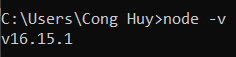
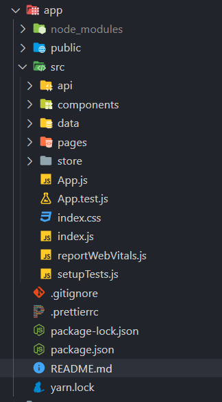
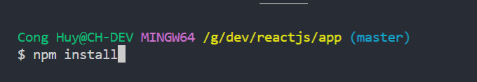
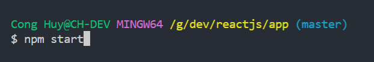

# 1. Cài NodeJS

## Bản v16.17.0 LTS

https://nodejs.org/dist/v16.17.0/node-v16.17.0-x64.msi

> Vào CMD nếu chạy lệnh `node -v` ra phiên bản thì đã cài thành công

# 2. Cài xong thì vào thư mục project

---

## Mở terminal, phải đảm bảo rằng đang trỏ tới thư mục đang chứa file `package.json`, sau đó gõ `npm install` để cài thư viện.

---

## Sau khi cài xong thư viện thì gõ `npm start` để chạy web

